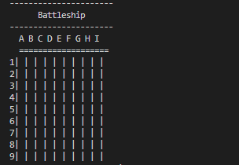
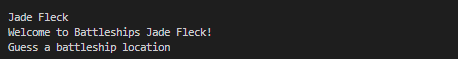
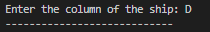
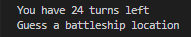
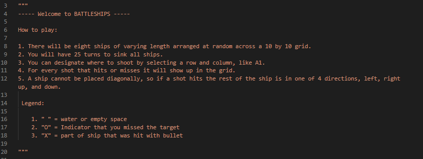
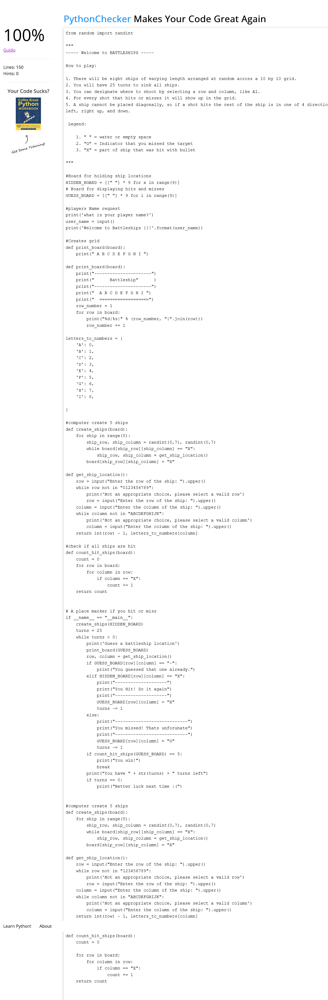

<<<<<<< HEAD
# Battlefield terminal game

This project is a Python game that is used in the terminal. It is a fully functional battleship game in which the user interacts with a grid-style system that allows you to select a row or column.  The goal is to sink all of the ships in a specified number of moves. 

## Features

Grid 9X9

A selection of different inputs for to interact with the terminal game.

- Enter Name
    
 

- Select row

 

- Select column

A selection of different outputs that gives the user more information.

- Hit or Miss

 

 

 - How many turns you have left

 

 ### comments on how to play the terminal game

 

## Technologies Used

### Main Languages Used

- python

### Frameworks, Libraries & Programs Used

 * [GitHub](https://github.com/github)

    - GitHub was used to store the project after pushing

* [Python tutor](https://pythontutor.com/python-compiler.html)

    - Online Python compiler, visual debugger, and AI tutor - the only tool that lets you visually debug your code step-by-step

* [Visual studio code](https://code.visualstudio.com/)

    - a code editor used to write code for web technologies such as JSX/React, HTML, CSS, Python, Less, and JSON.

# Deployment

 -This project was developed using GitPod, which was then committed and pushed to GitHub using the GitPod terminal.

## Deploying on GitHub Pages
To deploy this page to GitHub Pages from its GitHub repository, the following steps were taken:

1. Locate the GitHub Repository.
2. At the top of the repository, select Settings from the menu items.
3. Scroll down the Settings page to the "Pages" section.
4. Under "Source" click the drop-down menu labelled "None" and select "Main".
5. Upon selection, the page will automatically refresh meaning that the website is now deployed.
6. Scroll back down to the "Pages" section to retrieve the deployed link.

## Code 

 To gain a deeper understanding of coding i have used theses resources. 

* [W3Schools](https://www.w3schools.com/)

* [Stack overflow](https://stackoverflow.com/)
- YouTube tutorials
     -  * [YouTube](https://www.youtube.com/watch?v=tF1WRCrd_HQ&ab_channel=KnowledgeMavens)
    
 * [Python cheatsheet](https://www.pythoncheatsheet.org)

 * [battleship example](https://pythondex.com/python-battleship-game)

 ## Testing

 - Python
    - No errors were found when passing through the official PEP8 syntax validator.

## Remaining Bugs

 - No remaining bugs

=======

Welcome USER_NAME,

This is the Code Institute student template for deploying your third portfolio project, the Python command-line project. The last update to this file was: **August 17, 2021**

## Reminders

* Your code must be placed in the `run.py` file
* Your dependencies must be placed in the `requirements.txt` file
* Do not edit any of the other files or your code may not deploy properly

## Creating the Heroku app

When you create the app, you will need to add two buildpacks from the _Settings_ tab. The ordering is as follows:

1. `heroku/python`
2. `heroku/nodejs`

You must then create a _Config Var_ called `PORT`. Set this to `8000`

If you have credentials, such as in the Love Sandwiches project, you must create another _Config Var_ called `CREDS` and paste the JSON into the value field.

Connect your GitHub repository and deploy as normal.

## Constraints

The deployment terminal is set to 80 columns by 24 rows. That means that each line of text needs to be 80 characters or less otherwise it will be wrapped onto a second line.

-----
Happy coding!
>>>>>>> bad60100293fb05eb1a570a619db1982b0beedaf
